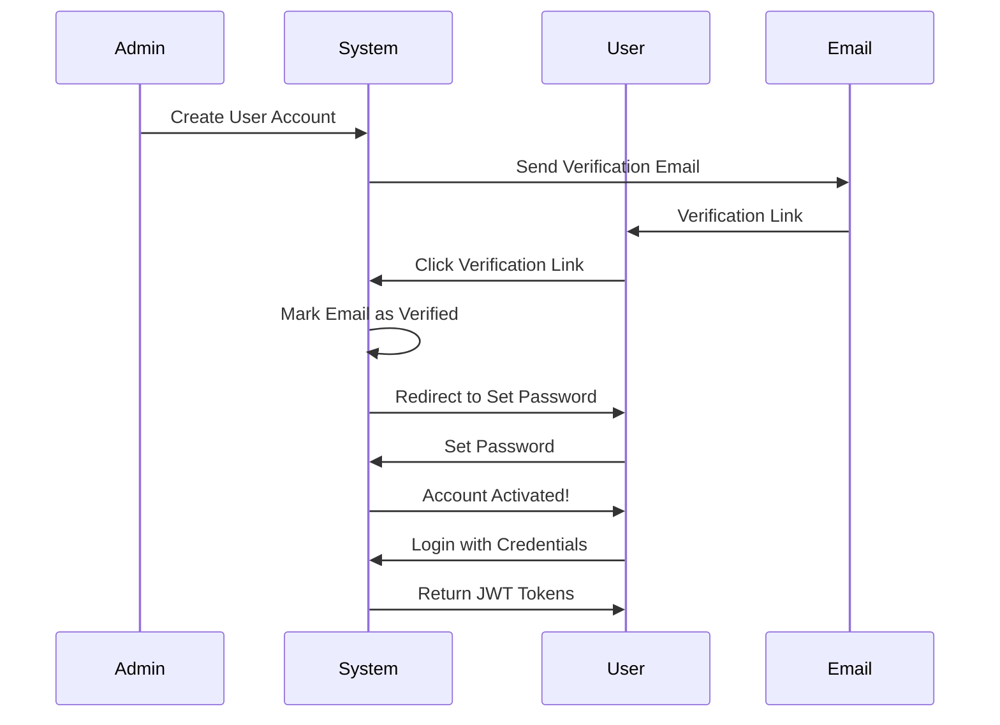

# Authentication Module (auth_app) 🔐

## Table of Contents
1. [What is this?](#what-is-this)
2. [Why do we need it?](#why-do-we-need-it)
3. [How does it work?](#how-does-it-work)
4. [API Endpoints](#api-endpoints)
5. [Visual Flows](#visual-flows)
6. [Models](#models)
7. [Security Features](#security-features)

---

## What is this?

The **Authentication Module** handles all user account management and security for the HRMS system. It provides:

- ✅ User registration and login
- ✅ Email verification
- ✅ Password management (set, change, reset)
- ✅ JWT token-based authentication
- ✅ User profile management

---

## Why do we need it?

### Problems It Solves:

1. **Security** - Ensures only authorized users can access the system
2. **Identity Management** - Tracks who is who in the system
3. **Access Control** - Different users have different permissions
4. **Account Recovery** - Users can reset forgotten passwords
5. **Email Verification** - Confirms users own their email addresses

---

## How does it work?

### Authentication Flow



### Key Components:

1. **User Model** - Stores user information
2. **JWT Tokens** - Secure authentication tokens
3. **Email Service** - Sends verification and reset emails
4. **Password Hashing** - Securely stores passwords

---

## API Endpoints

### Base URL: `/api/auth/`

---

### 1. Login

**Endpoint:** `POST /api/auth/login`

**Purpose:** Authenticate user and get JWT tokens

**Request:**
```json
{
  "username": "john.doe",
  "password": "SecurePass123!"
}
```

**Success Response (200):**
```json
{
  "access": "eyJ0eXAiOiJKV1QiLCJhbGc...",
  "refresh": "eyJ0eXAiOiJKV1QiLCJhbGc...",
  "user": {
    "id": 1,
    "username": "john.doe",
    "email": "john@company.com",
    "first_name": "John",
    "last_name": "Doe"
  }
}
```

**Error Responses:**
```json
// Invalid credentials
{
  "detail": "No active account found with the given credentials"
}

// Email not verified
{
  "detail": "Please verify your email before logging in"
}
```

---

### 2. Refresh Token

**Endpoint:** `POST /api/auth/refresh-token/`

**Purpose:** Get new access token using refresh token

**Request:**
```json
{
  "refresh": "eyJ0eXAiOiJKV1QiLCJhbGc..."
}
```

**Response:**
```json
{
  "access": "eyJ0eXAiOiJKV1QiLCJhbGc..."
}
```

---

### 3. Get User Profile

**Endpoint:** `GET /api/auth/me/`

**Purpose:** Get logged-in user's profile

**Headers:**
```
Authorization: Bearer <access_token>
```

**Response:**
```json
{
  "id": 1,
  "username": "john.doe",
  "email": "john@company.com",
  "first_name": "John",
  "last_name": "Doe",
  "phone_number": "+1234567890",
  "gender": "M",
  "job_title": "Software Engineer",
  "department": "Engineering",
  "photo": "/media/users/photos/john.jpg",
  "is_verified": true,
  "is_first_login": false
}
```

---

### 4. Create User (Admin Only)

**Endpoint:** `POST /api/auth/users/`

**Purpose:** Admin creates a new user account

**Headers:**
```
Authorization: Bearer <admin_access_token>
```

**Request:**
```json
{
  "username": "jane.smith",
  "email": "jane@company.com",
  "first_name": "Jane",
  "last_name": "Smith",
  "password": "SecurePass123!",
  "phone": "+919876543210",
  "department_id": 1,
  "designation_id": 5,
  "reporting_manager_id": 10,
  "joining_date": "2025-01-15"
}
```

**Response:**
```json
{
  "id": 2,
  "username": "jane.smith",
  "email": "jane@company.com",
  "first_name": "Jane",
  "last_name": "Smith",
  "is_active": false,
  "is_verified": false
}
```

**What Happens:**
1. User account created (inactive)
2. **Employee profile automatically created** with provided department/designation
3. Verification email sent to user
4. User must verify email and set password

---

### 5. Verify Email

**Endpoint:** `GET /api/auth/verify-email/<token>/`

**Purpose:** Verify user's email address

**Flow:**
1. User clicks link in verification email
2. System verifies token
3. Marks email as verified
4. Redirects to set-password page

**Response:**
- Redirects to: `https://frontend.com/set-password?token=<pwd_token>`

---

### 6. Set Password

**Endpoint:** `POST /api/auth/set-password/`

**Purpose:** Set password for first time or after reset

**Request:**
```json
{
  "token": "eyJ0eXAiOiJKV1QiLCJhbGc...",
  "new_password": "NewSecurePass123!"
}
```

**Response:**
```json
{
  "message": "Password set successfully"
}
```

**Use Cases:**
- First-time password setup after email verification
- Password reset after forgot-password flow

---

### 7. Forgot Password

**Endpoint:** `POST /api/auth/forgot-password/`

**Purpose:** Request password reset email

**Request:**
```json
{
  "email": "john@company.com"
}
```

**Response (Always):**
```json
{
  "message": "If an account exists, a password reset link has been sent."
}
```

**Security Note:** Response is same whether email exists or not (prevents email enumeration)

---

### 8. Change Password

**Endpoint:** `POST /api/auth/change-password/`

**Purpose:** Change password while logged in

**Headers:**
```
Authorization: Bearer <access_token>
```

**Request:**
```json
{
  "old_password": "OldPass123!",
  "new_password": "NewPass456!",
  "confirm_password": "NewPass456!"
}
```

**Response:**
```json
{
  "message": "Password changed successfully. Please login again."
}
```

---

## Visual Flows

### Complete User Onboarding Flow

```
┌─────────────────────────────────────────────────────────┐
│  STEP 1: Admin Creates User                             │
├─────────────────────────────────────────────────────────┤
│  POST /api/auth/users/                                  │
│  {                                                       │
│    "username": "jane.smith",                            │
│    "email": "jane@company.com",                         │
│    "first_name": "Jane",                                │
│    "last_name": "Smith",                                │
│    "phone": "+919876543210",                            │
│    "department_id": 1,                                  │
│    "designation_id": 5                                  │
│  }                                                       │
│                                                          │
│  ✅ User created (inactive, unverified)                 │
│  ✅ Employee profile auto-created                       │
│  📧 Verification email sent                             │
└─────────────────────────────────────────────────────────┘
                      ↓
┌─────────────────────────────────────────────────────────┐
│  STEP 2: User Verifies Email                            │
├─────────────────────────────────────────────────────────┤
│  User clicks link in email:                             │
│  GET /api/auth/verify-email/<token>/                    │
│                                                          │
│  ✅ Email verified                                      │
│  🔄 Redirected to set-password page                     │
└─────────────────────────────────────────────────────────┘
                      ↓
┌─────────────────────────────────────────────────────────┐
│  STEP 3: User Sets Password                             │
├─────────────────────────────────────────────────────────┤
│  POST /api/auth/set-password/                           │
│  {                                                       │
│    "token": "<pwd_token>",                              │
│    "new_password": "SecurePass123!"                     │
│  }                                                       │
│                                                          │
│  ✅ Password set                                        │
│  ✅ Account activated                                   │
└─────────────────────────────────────────────────────────┘
                      ↓
┌─────────────────────────────────────────────────────────┐
│  STEP 4: User Logs In                                   │
├─────────────────────────────────────────────────────────┤
│  POST /api/auth/login                                   │
│  {                                                       │
│    "username": "jane.smith",                            │
│    "password": "SecurePass123!"                         │
│  }                                                       │
│                                                          │
│  ✅ JWT tokens returned                                 │
│  🎉 User can now access system                          │
└─────────────────────────────────────────────────────────┘
```

### Forgot Password Flow

```
┌─────────────────────────────────────────────────────────┐
│  STEP 1: User Requests Reset                            │
├─────────────────────────────────────────────────────────┤
│  POST /api/auth/forgot-password/                        │
│  { "email": "john@company.com" }                        │
│                                                          │
│  📧 Reset email sent (if email exists)                  │
└─────────────────────────────────────────────────────────┘
                      ↓
┌─────────────────────────────────────────────────────────┐
│  STEP 2: User Clicks Reset Link                         │
├─────────────────────────────────────────────────────────┤
│  Link contains token                                    │
│  Frontend shows set-password form                       │
└─────────────────────────────────────────────────────────┘
                      ↓
┌─────────────────────────────────────────────────────────┐
│  STEP 3: User Sets New Password                         │
├─────────────────────────────────────────────────────────┤
│  POST /api/auth/set-password/                           │
│  {                                                       │
│    "token": "<reset_token>",                            │
│    "new_password": "NewPass456!"                        │
│  }                                                       │
│                                                          │
│  ✅ Password updated                                    │
│  🔐 User can login with new password                    │
└─────────────────────────────────────────────────────────┘
```

---

## Models

### User Model

```python
class User(AbstractUser):
    # Authentication
    email = models.EmailField(unique=True)
    is_verified = models.BooleanField(default=False)
    is_first_login = models.BooleanField(default=True)
    
    # Profile
    phone_number = models.CharField(max_length=15)
    photo = models.ImageField(upload_to="users/photos/")
    gender = models.CharField(max_length=1, choices=GENDER_CHOICES)
    job_title = models.CharField(max_length=100)
    department = models.CharField(max_length=100)
```

**Key Fields:**
- `email` - Unique email address (used for login)
- `is_verified` - Email verification status
- `is_first_login` - Tracks if user has logged in before
- `is_active` - Account activation status

---

## Security Features

### 1. JWT Authentication

```
Access Token:  Valid for 24 hours
Refresh Token: Valid for 7 days
```

**How it works:**
1. User logs in → Gets access + refresh tokens
2. Use access token for API requests
3. When access expires → Use refresh token to get new access
4. When refresh expires → User must login again

### 2. Password Security

- ✅ Passwords hashed using Django's PBKDF2 algorithm
- ✅ Never stored in plain text
- ✅ Minimum password requirements enforced
- ✅ Old password required for password change

### 3. Email Verification

- ✅ Users must verify email before login
- ✅ Verification tokens expire after 24 hours
- ✅ Admins bypass verification requirement

### 4. Token Security

- ✅ Tokens signed with secret key
- ✅ Tokens expire after set time
- ✅ Refresh token rotation enabled
- ✅ Blacklisting after rotation

### 5. Security Best Practices

- ✅ No email enumeration (forgot password always returns success)
- ✅ Rate limiting on login attempts
- ✅ HTTPS required in production
- ✅ CORS configured for frontend domain only

---

## Error Handling

### Common Errors:

| Error Code | Message | Cause |
|------------|---------|-------|
| 400 | Invalid credentials | Wrong username/password |
| 400 | Email not verified | User hasn't verified email |
| 401 | Authentication required | No token provided |
| 401 | Token expired | Access token expired |
| 403 | Permission denied | User lacks required permission |
| 404 | User not found | Invalid user ID |

---

## Testing

### Test Login:
```bash
curl -X POST http://localhost:8000/api/auth/login \
  -H "Content-Type: application/json" \
  -d '{
    "username": "admin",
    "password": "admin123"
  }'
```

### Test Get Profile:
```bash
curl -X GET http://localhost:8000/api/auth/me/ \
  -H "Authorization: Bearer <access_token>"
```

### Test Refresh Token:
```bash
curl -X POST http://localhost:8000/api/auth/refresh-token/ \
  -H "Content-Type: application/json" \
  -d '{
    "refresh": "<refresh_token>"
  }'
```

---

## Environment Variables

Required in `.env`:

```env
# JWT Settings
SECRET_KEY=your-secret-key-here

# Email Settings
EMAIL_BACKEND=anymail.backends.sendinblue.EmailBackend
MAILGUN_API_KEY=your-mailgun-key

# Frontend URL (for redirects)
BASE_URL_FRONTEND=https://your-frontend.com
```

---

## Summary

The Authentication Module provides:

1. ✅ **Secure Login** - JWT-based authentication
2. ✅ **User Management** - Admin can create users
3. ✅ **Email Verification** - Confirms email ownership
4. ✅ **Password Management** - Set, change, and reset passwords
5. ✅ **Profile Access** - Users can view their profile

**Key Benefit:** Centralized, secure authentication for the entire HRMS system! 🔐
