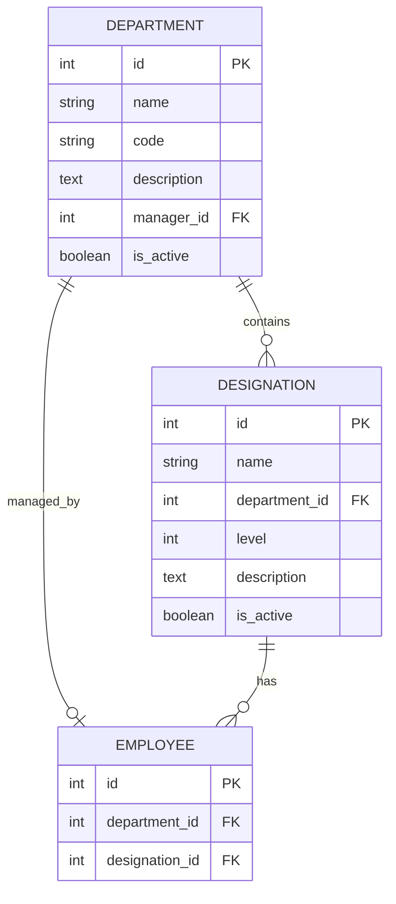

# Departments Module 🏢

## Table of Contents
1. [What is this?](#what-is-this)
2. [Why do we need it?](#why-do-we-need-it)
3. [How does it work?](#how-does-it-work)
4. [API Endpoints](#api-endpoints)
5. [Visual Flows](#visual-flows)
6. [Models](#models)

---

## What is this?

The **Departments Module** manages organizational structure by handling:

- ✅ Departments (Engineering, HR, Sales, etc.)
- ✅ Designations/Job Titles (Manager, Developer, etc.)
- ✅ Department hierarchies
- ✅ Employee-Department relationships

---

## Why do we need it?

### Problems It Solves:

1. **Organization** - Groups employees by function
2. **Hierarchy** - Defines reporting structure
3. **Role Clarity** - Clear job titles and levels
4. **Resource Management** - Track team sizes and composition
5. **Reporting** - Generate department-wise reports

---

## How does it work?

### Structure

```
Company
  ├── Engineering Department
  │   ├── Software Engineer (Level 1)
  │   ├── Senior Software Engineer (Level 2)
  │   └── Engineering Manager (Level 3)
  │
  ├── HR Department
  │   ├── HR Executive (Level 1)
  │   └── HR Manager (Level 2)
  │
  └── Sales Department
      ├── Sales Representative (Level 1)
      └── Sales Manager (Level 2)
```

### Relationship Diagram



---

## API Endpoints

### Base URL: `/api/departments/`

---

### 1. List All Departments

**Endpoint:** `GET /api/departments/`

**Purpose:** Get all departments

**Headers:**
```
Authorization: Bearer <access_token>
```

**Query Parameters:**
- `search` - Search by name, code, or description
- `is_active` - Filter by active status (true/false)
- `ordering` - Sort by name, created_at

**Response:**
```json
[
  {
    "id": 1,
    "name": "Engineering",
    "code": "ENG",
    "description": "Software Development Team",
    "manager": {
      "id": 5,
      "name": "John Doe",
      "employee_id": "EMP001"
    },
    "employee_count": 25,
    "designation_count": 5,
    "is_active": true,
    "created_at": "2025-01-01T00:00:00Z"
  },
  {
    "id": 2,
    "name": "Human Resources",
    "code": "HR",
    "description": "HR and Admin",
    "manager": null,
    "employee_count": 5,
    "designation_count": 3,
    "is_active": true,
    "created_at": "2025-01-01T00:00:00Z"
  }
]
```

---

### 2. Get Department Details

**Endpoint:** `GET /api/departments/{id}/`

**Purpose:** Get detailed information about a specific department

**Response:**
```json
{
  "id": 1,
  "name": "Engineering",
  "code": "ENG",
  "description": "Software Development Team",
  "manager": {
    "id": 5,
    "name": "John Doe",
    "employee_id": "EMP001",
    "email": "john@company.com",
    "designation": "Engineering Manager"
  },
  "designations": [
    {
      "id": 1,
      "name": "Software Engineer",
      "level": 1,
      "employee_count": 15
    },
    {
      "id": 2,
      "name": "Senior Software Engineer",
      "level": 2,
      "employee_count": 8
    },
    {
      "id": 3,
      "name": "Engineering Manager",
      "level": 3,
      "employee_count": 2
    }
  ],
  "employee_count": 25,
  "is_active": true,
  "created_at": "2025-01-01T00:00:00Z",
  "updated_at": "2025-01-15T10:30:00Z"
}
```

---

### 3. Create Department

**Endpoint:** `POST /api/departments/`

**Purpose:** Create a new department (Admin/HR only)

**Request:**
```json
{
  "name": "Marketing",
  "code": "MKT",
  "description": "Marketing and Brand Management",
  "manager": 10,
  "is_active": true
}
```

**Response:**
```json
{
  "id": 3,
  "name": "Marketing",
  "code": "MKT",
  "description": "Marketing and Brand Management",
  "manager": {
    "id": 10,
    "name": "Jane Smith",
    "employee_id": "EMP010"
  },
  "employee_count": 0,
  "designation_count": 0,
  "is_active": true,
  "created_at": "2025-01-20T14:00:00Z"
}
```

---

### 4. Update Department

**Endpoint:** `PUT /api/departments/{id}/` or `PATCH /api/departments/{id}/`

**Purpose:** Update department information

**Request:**
```json
{
  "description": "Updated description",
  "manager": 12
}
```

**Response:**
```json
{
  "id": 3,
  "name": "Marketing",
  "code": "MKT",
  "description": "Updated description",
  "manager": {
    "id": 12,
    "name": "New Manager",
    "employee_id": "EMP012"
  },
  "is_active": true
}
```

---

### 5. Delete Department

**Endpoint:** `DELETE /api/departments/{id}/`

**Purpose:** Delete a department (Admin only)

**Response:**
```
204 No Content
```

**Note:** Cannot delete if department has employees

---

### 6. Get Department Employees

**Endpoint:** `GET /api/departments/{id}/employees/`

**Purpose:** Get all employees in a department

**Response:**
```json
[
  {
    "id": 1,
    "employee_id": "EMP001",
    "name": "John Doe",
    "email": "john@company.com",
    "designation": "Software Engineer",
    "phone": "+1234567890",
    "employment_status": "active"
  },
  {
    "id": 2,
    "employee_id": "EMP002",
    "name": "Jane Smith",
    "email": "jane@company.com",
    "designation": "Senior Software Engineer",
    "phone": "+1234567891",
    "employment_status": "active"
  }
]
```

---

## Designation Endpoints

### Base URL: `/api/designations/`

---

### 7. List All Designations

**Endpoint:** `GET /api/designations/`

**Query Parameters:**
- `department` - Filter by department ID
- `level` - Filter by hierarchy level
- `search` - Search by name or description
- `is_active` - Filter by active status

**Response:**
```json
[
  {
    "id": 1,
    "name": "Software Engineer",
    "department": {
      "id": 1,
      "name": "Engineering",
      "code": "ENG"
    },
    "level": 1,
    "description": "Entry-level software developer",
    "employee_count": 15,
    "is_active": true
  },
  {
    "id": 2,
    "name": "Senior Software Engineer",
    "department": {
      "id": 1,
      "name": "Engineering",
      "code": "ENG"
    },
    "level": 2,
    "description": "Experienced software developer",
    "employee_count": 8,
    "is_active": true
  }
]
```

---

### 8. Create Designation

**Endpoint:** `POST /api/designations/`

**Request:**
```json
{
  "name": "Tech Lead",
  "department": 1,
  "level": 3,
  "description": "Technical leadership role",
  "is_active": true
}
```

**Response:**
```json
{
  "id": 10,
  "name": "Tech Lead",
  "department": {
    "id": 1,
    "name": "Engineering",
    "code": "ENG"
  },
  "level": 3,
  "description": "Technical leadership role",
  "employee_count": 0,
  "is_active": true,
  "created_at": "2025-01-20T15:00:00Z"
}
```

---

## Visual Flows

### Department Creation Flow

```
┌─────────────────────────────────────────────────────────┐
│  STEP 1: Admin Creates Department                       │
├─────────────────────────────────────────────────────────┤
│  POST /api/departments/                                 │
│  {                                                       │
│    "name": "Marketing",                                 │
│    "code": "MKT",                                       │
│    "description": "Marketing Team"                      │
│  }                                                       │
│                                                          │
│  ✅ Department created                                  │
└─────────────────────────────────────────────────────────┘
                      ↓
┌─────────────────────────────────────────────────────────┐
│  STEP 2: Add Designations                               │
├─────────────────────────────────────────────────────────┤
│  POST /api/designations/                                │
│  {                                                       │
│    "name": "Marketing Executive",                       │
│    "department": 3,                                     │
│    "level": 1                                           │
│  }                                                       │
│                                                          │
│  POST /api/designations/                                │
│  {                                                       │
│    "name": "Marketing Manager",                         │
│    "department": 3,                                     │
│    "level": 2                                           │
│  }                                                       │
│                                                          │
│  ✅ Designations created                                │
└─────────────────────────────────────────────────────────┘
                      ↓
┌─────────────────────────────────────────────────────────┐
│  STEP 3: Assign Manager                                 │
├─────────────────────────────────────────────────────────┤
│  PATCH /api/departments/3/                              │
│  {                                                       │
│    "manager": 15                                        │
│  }                                                       │
│                                                          │
│  ✅ Manager assigned                                    │
└─────────────────────────────────────────────────────────┘
                      ↓
┌─────────────────────────────────────────────────────────┐
│  STEP 4: Add Employees                                  │
├─────────────────────────────────────────────────────────┤
│  (Done through Employee module)                         │
│  Employees are assigned department and designation      │
│                                                          │
│  ✅ Department fully set up!                            │
└─────────────────────────────────────────────────────────┘
```

### Hierarchy Visualization

```
Engineering Department (ENG)
├── Level 3: Engineering Manager (2 employees)
│   └── Manages entire department
├── Level 2: Senior Software Engineer (8 employees)
│   └── Leads projects and mentors juniors
└── Level 1: Software Engineer (15 employees)
    └── Individual contributors

HR Department (HR)
├── Level 2: HR Manager (1 employee)
│   └── Manages HR operations
└── Level 1: HR Executive (4 employees)
    └── Handles day-to-day HR tasks
```

---

## Models

### Department Model

```python
class Department(models.Model):
    name = models.CharField(max_length=100, unique=True)
    code = models.CharField(max_length=20, unique=True)
    description = models.TextField(blank=True)
    manager = models.ForeignKey(
        'employees.Employee',
        on_delete=models.SET_NULL,
        null=True,
        related_name='managed_departments'
    )
    is_active = models.BooleanField(default=True)
    created_at = models.DateTimeField(auto_now_add=True)
    updated_at = models.DateTimeField(auto_now=True)
```

**Key Fields:**
- `name` - Department name (unique)
- `code` - Short code (e.g., "ENG", "HR")
- `manager` - Employee who manages the department
- `is_active` - Whether department is currently active

---

### Designation Model

```python
class Designation(models.Model):
    name = models.CharField(max_length=100)
    department = models.ForeignKey(
        Department,
        on_delete=models.CASCADE,
        related_name='designations'
    )
    level = models.IntegerField(
        default=1,
        help_text="Hierarchy level (1=lowest, 10=highest)"
    )
    description = models.TextField(blank=True)
    is_active = models.BooleanField(default=True)
```

**Key Fields:**
- `name` - Designation title
- `department` - Which department this belongs to
- `level` - Hierarchy level (1-10)
- Unique together: (name, department)

---

## Features

### Search & Filter

```bash
# Search departments
GET /api/departments/?search=engineering

# Filter active departments
GET /api/departments/?is_active=true

# Sort by name
GET /api/departments/?ordering=name

# Filter designations by department
GET /api/designations/?department=1

# Filter by level
GET /api/designations/?level=2
```

### Permissions

- **List/Retrieve** - All authenticated users
- **Create/Update** - Admin and HR only
- **Delete** - Admin only
- **Non-admin users** - See only active departments/designations

---

## Testing

### Test List Departments:
```bash
curl -X GET http://localhost:8000/api/departments/ \
  -H "Authorization: Bearer <token>"
```

### Test Create Department:
```bash
curl -X POST http://localhost:8000/api/departments/ \
  -H "Authorization: Bearer <admin_token>" \
  -H "Content-Type: application/json" \
  -d '{
    "name": "Finance",
    "code": "FIN",
    "description": "Finance and Accounting"
  }'
```

### Test Get Department Employees:
```bash
curl -X GET http://localhost:8000/api/departments/1/employees/ \
  -H "Authorization: Bearer <token>"
```

---

## Summary

The Departments Module provides:

1. ✅ **Organization Structure** - Clear department hierarchy
2. ✅ **Job Titles** - Standardized designations with levels
3. ✅ **Management** - Assign department managers
4. ✅ **Reporting** - Track team composition
5. ✅ **Flexibility** - Easy to add/modify departments

**Key Benefit:** Organized workforce structure for better management! 🏢
