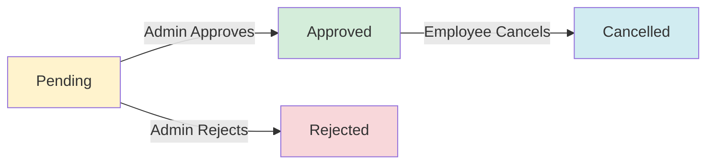
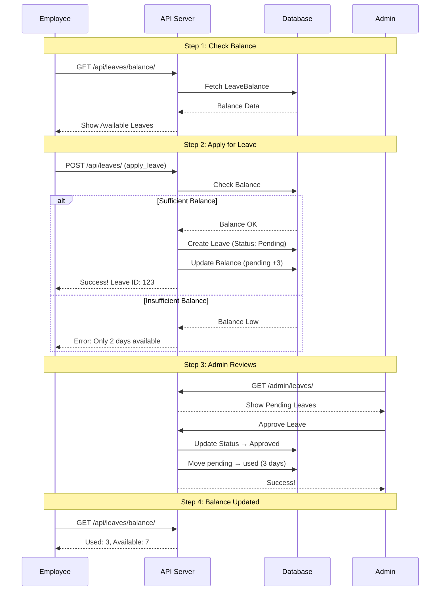
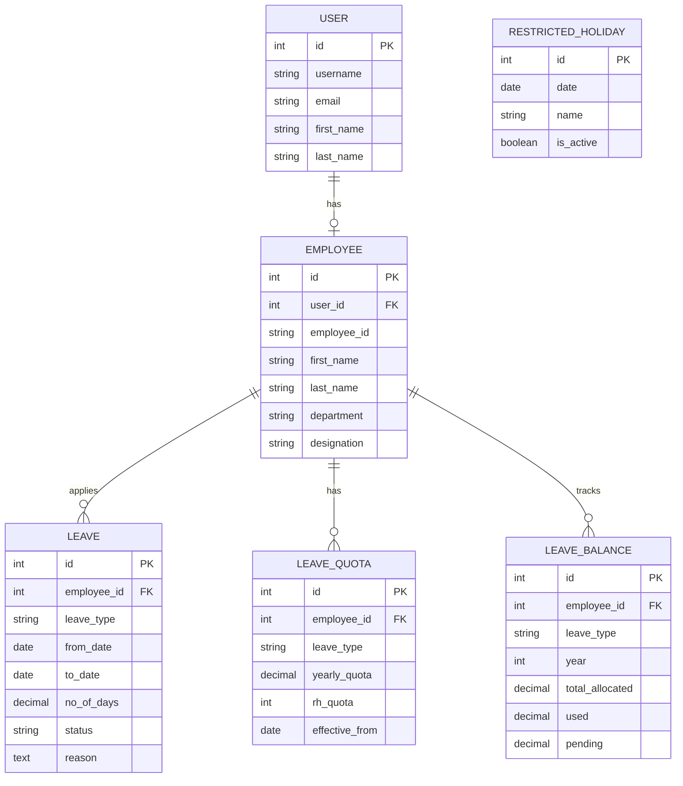

# Leave Management System - Visual Guide 🎓

> **Important Update (2025-12-22):** The Leave system is now connected to the **Employee** model instead of directly to User. This means users must have an employee profile to apply for leaves.

## Table of Contents
1. [System Overview](#system-overview)
2. [Core Concepts](#core-concepts)
3. [Data Flow](#data-flow)
4. [API Workflows](#api-workflows)
5. [Database Relationships](#database-relationships)
6. [Real-World Examples](#real-world-examples)

---

## System Overview

### What Does This System Do?

```
┌─────────────────────────────────────────────────────────┐
│           LEAVE MANAGEMENT SYSTEM                        │
├─────────────────────────────────────────────────────────┤
│                                                          │
│  1. Calculate Working Days  📅                          │
│     → Count business days between dates                 │
│     → Exclude weekends & holidays                       │
│                                                          │
│  2. Apply for Leave  ✍️                                 │
│     → Submit leave request                              │
│     → Check balance automatically                       │
│                                                          │
│  3. Track Leave Balance  💰                             │
│     → See how many leaves you have                      │
│     → Auto-update on approval/rejection                 │
│                                                          │
│  4. Admin Controls  👨‍💼                                   │
│     → Set quotas for employees                          │
│     → Approve/reject requests                           │
│     → Manage Restricted Holidays                        │
│                                                          │
└─────────────────────────────────────────────────────────┘
```

---

## Core Concepts

### 1. Leave Types

```
┌──────────────────────────────────────────────────┐
│  LEAVE TYPES                                     │
├──────────────────────────────────────────────────┤
│                                                  │
│  📝 Casual Leave      → Short personal breaks    │
│  🤒 Sick Leave        → Medical reasons          │
│  💼 Earned Leave      → Accumulated over time    │
│  🚫 Unpaid Leave      → No salary deduction      │
│  👶 Maternity Leave   → For mothers              │
│  👨‍👶 Paternity Leave  → For fathers              │
│  ❓ Other             → Miscellaneous            │
│                                                  │
└──────────────────────────────────────────────────┘
```

### 2. Leave Status Flow



### 3. Leave Balance Components

```
┌─────────────────────────────────────────────────────────┐
│  YOUR LEAVE BALANCE                                      │
├─────────────────────────────────────────────────────────┤
│                                                          │
│  Total Allocated:  12 days  ← Quota + Carry Forward     │
│                                                          │
│  ├─ Yearly Quota:        10 days                        │
│  └─ Carried Forward:      2 days (from last year)       │
│                                                          │
│  Used:              3 days  ← Approved leaves taken     │
│  Pending:           1 day   ← Waiting for approval      │
│                                                          │
│  ═══════════════════════════════════════════════════    │
│  AVAILABLE:         8 days  ← What you can use now      │
│                                                          │
└─────────────────────────────────────────────────────────┘

Formula: Available = Total Allocated - Used - Pending
```

### 4. Restricted Holidays (RH)

```
┌─────────────────────────────────────────────────────────┐
│  RESTRICTED HOLIDAYS (RH)                                │
├─────────────────────────────────────────────────────────┤
│                                                          │
│  What are RH?                                           │
│  → Optional holidays you can choose to take             │
│  → Example: Holi, Diwali, Christmas, etc.              │
│                                                          │
│  How it works:                                          │
│  1. Admin sets RH quota (e.g., 2 per year)             │
│  2. Admin adds RH dates to system                      │
│  3. Employee picks which RH to take                     │
│  4. System tracks RH usage separately                   │
│                                                          │
│  Example:                                               │
│  ┌────────────────────────────────────┐                │
│  │ RH Allocated:  2                   │                │
│  │ RH Used:       1  (Diwali)         │                │
│  │ RH Available:  1                   │                │
│  └────────────────────────────────────┘                │
│                                                          │
└─────────────────────────────────────────────────────────┘
```

---

## Data Flow

### Complete Leave Application Flow



### Balance Update Logic

```
SCENARIO 1: Employee Applies for Leave
═══════════════════════════════════════
Before:
  Total: 10 | Used: 0 | Pending: 0 | Available: 10

Action: Apply for 3 days
  ↓
After:
  Total: 10 | Used: 0 | Pending: 3 | Available: 7
                              ↑
                         Added here


SCENARIO 2: Admin Approves Leave
═══════════════════════════════════════
Before:
  Total: 10 | Used: 0 | Pending: 3 | Available: 7

Action: Approve 3 days
  ↓
After:
  Total: 10 | Used: 3 | Pending: 0 | Available: 7
                   ↑         ↓
              Moved from pending


SCENARIO 3: Admin Rejects Leave
═══════════════════════════════════════
Before:
  Total: 10 | Used: 0 | Pending: 3 | Available: 7

Action: Reject 3 days
  ↓
After:
  Total: 10 | Used: 0 | Pending: 0 | Available: 10
                              ↓            ↑
                         Cleared    Restored
```

---

## API Workflows

### 1. Calculate Working Days

```
┌─────────────────────────────────────────────────────────┐
│  API: Calculate Working Days                             │
├─────────────────────────────────────────────────────────┤
│                                                          │
│  Input:                                                  │
│  ┌────────────────────────────────────┐                │
│  │ Start Date: 2025-12-22 (Monday)    │                │
│  │ End Date:   2025-12-28 (Sunday)    │                │
│  └────────────────────────────────────┘                │
│                                                          │
│  Processing:                                            │
│  ┌────────────────────────────────────┐                │
│  │ Mon 22 → Working Day  ✅           │                │
│  │ Tue 23 → Working Day  ✅           │                │
│  │ Wed 24 → Working Day  ✅           │                │
│  │ Thu 25 → Holiday (Christmas) 🎄    │                │
│  │ Fri 26 → Working Day  ✅           │                │
│  │ Sat 27 → Weekend      🏖️           │                │
│  │ Sun 28 → Weekend      🏖️           │                │
│  └────────────────────────────────────┘                │
│                                                          │
│  Output:                                                │
│  ┌────────────────────────────────────┐                │
│  │ Working Days: 4                    │                │
│  │ Holidays:     1                    │                │
│  │ Weekends:     2                    │                │
│  │ Total Days:   7                    │                │
│  └────────────────────────────────────┘                │
│                                                          │
└─────────────────────────────────────────────────────────┘
```

### 2. Apply for Leave (with Balance Check)

```
┌─────────────────────────────────────────────────────────┐
│  API: Apply for Leave                                    │
├─────────────────────────────────────────────────────────┤
│                                                          │
│  Step 1: Employee Submits Request                       │
│  ┌────────────────────────────────────┐                │
│  │ From: 2025-12-25                   │                │
│  │ To:   2025-12-27                   │                │
│  │ Days: 3                            │                │
│  │ Type: Casual Leave                 │                │
│  │ Reason: "Family function"          │                │
│  └────────────────────────────────────┘                │
│                                                          │
│  Step 2: System Checks Balance                          │
│  ┌────────────────────────────────────┐                │
│  │ Available: 8 days                  │                │
│  │ Requested: 3 days                  │                │
│  │ Check: 8 >= 3 ? ✅ YES             │                │
│  └────────────────────────────────────┘                │
│                                                          │
│  Step 3: Create Leave Record                            │
│  ┌────────────────────────────────────┐                │
│  │ Status: Pending                    │                │
│  │ Leave ID: 123                      │                │
│  └────────────────────────────────────┘                │
│                                                          │
│  Step 4: Update Balance                                 │
│  ┌────────────────────────────────────┐                │
│  │ Before: Available = 8              │                │
│  │ After:  Available = 5              │                │
│  │         Pending = 3                │                │
│  └────────────────────────────────────┘                │
│                                                          │
└─────────────────────────────────────────────────────────┘
```

### 3. Get Leave Balance

```
┌─────────────────────────────────────────────────────────┐
│  API: GET /api/leaves/balance/                          │
├─────────────────────────────────────────────────────────┤
│                                                          │
│  Response:                                              │
│  {                                                       │
│    "Casual Leave": {                                    │
│      "allocated": 12,      ← Total for the year        │
│      "used": 3,            ← Already taken              │
│      "pending": 1,         ← Waiting approval           │
│      "available": 8,       ← Can apply now              │
│      "carried_forward": 2  ← From last year             │
│    },                                                    │
│    "Sick Leave": {                                      │
│      "allocated": 10,                                   │
│      "used": 1,                                         │
│      "pending": 0,                                      │
│      "available": 9,                                    │
│      "carried_forward": 0                               │
│    },                                                    │
│    "rh": {                                              │
│      "allocated": 2,       ← RH quota                   │
│      "used": 0,            ← RH taken                   │
│      "available": 2        ← RH remaining               │
│    }                                                     │
│  }                                                       │
│                                                          │
└─────────────────────────────────────────────────────────┘
```

---

## Database Relationships

### Entity Relationship Diagram



> **Key Change:** Leave is now connected to Employee, not directly to User. User → Employee is a OneToOne relationship.

### How Tables Work Together

```
┌─────────────────────────────────────────────────────────┐
│  EXAMPLE: Employee "John" Applies for Leave              │
├─────────────────────────────────────────────────────────┤
│                                                          │
│  0. USER TABLE (Login Account)                          │
│  ┌────────────────────────────────────┐                │
│  │ ID: 1                              │                │
│  │ Username: john.doe                 │                │
│  │ Email: john@company.com            │                │
│  └────────────────────────────────────┘                │
│                  ↓ (OneToOne)                           │
│  1. EMPLOYEE TABLE (HR Record)                          │
│  ┌────────────────────────────────────┐                │
│  │ ID: 101                            │                │
│  │ User ID: 1                         │                │
│  │ Employee ID: EMP001                │                │
│  │ Name: John Doe                     │                │
│  │ Department: Engineering            │                │
│  └────────────────────────────────────┘                │
│                  ↓ (ForeignKey)                         │
│  2. LEAVE_QUOTA (Admin Set This)                        │
│  ┌────────────────────────────────────┐                │
│  │ Employee ID: 101                   │                │
│  │ Leave Type: Casual Leave           │                │
│  │ Yearly Quota: 12 days              │                │
│  │ RH Quota: 2 days                   │                │
│  └────────────────────────────────────┘                │
│                                                          │
│  3. LEAVE_BALANCE (Current Status)                      │
│  ┌────────────────────────────────────┐                │
│  │ Employee ID: 101                   │                │
│  │ Leave Type: Casual Leave           │                │
│  │ Year: 2025                         │                │
│  │ Total Allocated: 12                │                │
│  │ Used: 3                            │                │
│  │ Pending: 0                         │                │
│  │ Available: 9                       │                │
│  └────────────────────────────────────┘                │
│                                                          │
│  4. LEAVE (John's Request)                              │
│  ┌────────────────────────────────────┐                │
│  │ Employee ID: 101                   │                │
│  │ Leave Type: Casual Leave           │                │
│  │ From: 2025-12-25                   │                │
│  │ To: 2025-12-27                     │                │
│  │ Days: 3                            │                │
│  │ Status: Pending                    │                │
│  └────────────────────────────────────┘                │
│                                                          │
│  5. LEAVE_BALANCE (After Application)                   │
│  ┌────────────────────────────────────┐                │
│  │ Used: 3      (unchanged)           │                │
│  │ Pending: 3   (added)               │                │
│  │ Available: 6 (reduced)             │                │
│  └────────────────────────────────────┘                │
│                                                          │
└─────────────────────────────────────────────────────────┘

Flow: User → Employee → Leave
      (Login) → (HR Record) → (Leave Request)
```

---

## Real-World Examples

### Example 1: New Employee Setup

```
STEP 1: HR Creates Quota
═══════════════════════════════════════
Admin goes to: /admin/leaves/leavequota/

Creates:
  Employee: Sarah
  Leave Type: Casual Leave
  Yearly Quota: 12 days
  Monthly Quota: 1 day
  RH Quota: 2 days
  Carry Forward Limit: 5 days
  Effective From: 2025-01-01


STEP 2: HR Creates Balance
═══════════════════════════════════════
Admin goes to: /admin/leaves/leavebalance/

Creates:
  Employee: Sarah
  Leave Type: Casual Leave
  Year: 2025
  Total Allocated: 12 days
  RH Allocated: 2 days


STEP 3: Sarah Can Now Apply
═══════════════════════════════════════
Sarah logs in and sees:
  ┌────────────────────────────────────┐
  │ Casual Leave: 12 days available    │
  │ RH: 2 days available               │
  └────────────────────────────────────┘
```

### Example 2: Leave Application Journey

```
DAY 1: Sarah Applies
═══════════════════════════════════════
POST /api/leaves/
{
  "from_date": "2025-12-25",
  "to_date": "2025-12-27",
  "no_of_days": 3,
  "leave_type": "Casual Leave",
  "reason": "Christmas vacation"
}

✅ Success! Leave ID: 456
Balance Updated:
  Available: 12 → 9
  Pending: 0 → 3


DAY 2: Manager Reviews
═══════════════════════════════════════
Manager logs into /admin/leaves/leave/
Sees: Sarah's request for 3 days
Clicks: Approve

System automatically:
  1. Changes status to "Approved"
  2. Updates balance:
     Pending: 3 → 0
     Used: 0 → 3
     Available: stays 9


DAY 3: Sarah Checks Balance
═══════════════════════════════════════
GET /api/leaves/balance/

Response:
{
  "Casual Leave": {
    "allocated": 12,
    "used": 3,
    "pending": 0,
    "available": 9
  }
}
```

### Example 3: Insufficient Balance

```
Scenario: Sarah tries to apply for 15 days
═══════════════════════════════════════

Current Balance:
  Available: 9 days

Request:
  POST /api/leaves/
  {
    "no_of_days": 15,
    "leave_type": "Casual Leave"
  }

❌ Error Response:
{
  "no_of_days": [
    "Insufficient leave balance. Available: 9.0, Requested: 15.0"
  ]
}

Leave NOT created
Balance unchanged
```

### Example 4: Year-End Carry Forward

```
December 31, 2025
═══════════════════════════════════════

Sarah's Balance:
  Total Allocated: 12
  Used: 7
  Available: 5 (unused)

Carry Forward Limit: 5 days

January 1, 2026
═══════════════════════════════════════

Admin runs carry forward process

New Balance Created:
  Year: 2026
  Yearly Quota: 12
  Carried Forward: 5 (from 2025)
  Total Allocated: 17 (12 + 5)
  Used: 0
  Available: 17

Sarah now has 17 days for 2026! 🎉
```

---

## Quick Reference

### Key Formulas

```
1. Available Balance
   Available = Total Allocated - Used - Pending

2. Total Allocated
   Total Allocated = Yearly Quota + Carried Forward

3. After Approval
   Used = Used + Pending
   Pending = 0

4. After Rejection
   Pending = 0
   (Available increases automatically)
```

### Status Transitions

```
Pending → Approved  (Admin approves)
Pending → Rejected  (Admin rejects)
Approved → Cancelled (Employee cancels)
```

### Admin Tasks Checklist

```
☐ Set up Leave Quota for new employees
☐ Create Leave Balance records
☐ Add Restricted Holiday dates
☐ Review and approve/reject leave requests
☐ Run year-end carry forward process
```

### Employee Actions

```
☐ Check balance before applying
☐ Apply for leave
☐ Upload supporting documents (if needed)
☐ Check application status
☐ Cancel approved leaves (if needed)
```

---

## Summary

This Leave Management System provides:

1. **Automated Balance Tracking** - No manual calculations needed
2. **Real-time Validation** - Prevents over-application
3. **Admin Control** - HR sets all quotas and rules
4. **Transparency** - Employees always know their balance
5. **Audit Trail** - All changes are tracked

**Key Benefit:** Reduces HR workload by 80% through automation! 🚀
