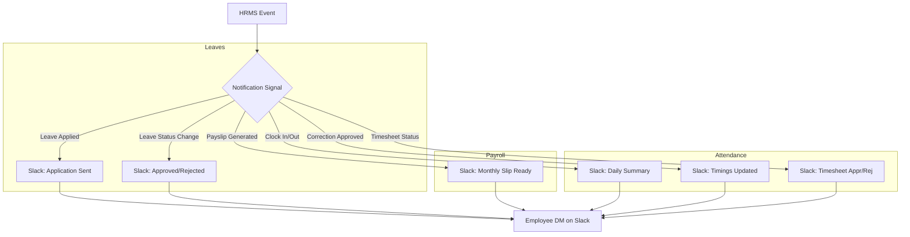

# Notifications Module (Slack Integration)

The Notifications module handles automated communication with employees via Slack. It integrates with various life-cycle events in the HRMS (Leaves, Attendance, Payroll) to keep employees informed in real-time.

## Visual Flow: Slack Notification Triggers

## Setup Instructions

### 1. Slack App Configuration
1.  Create a Slack App at [api.slack.com](https://api.slack.com).
2.  Add **Bot Token Scopes**:
    - `chat:write`: To send messages.
    - `users:read`: To get user list.
    - `users:read.email`: To lookup user IDs by email address.
3.  Install the app to your workspace.
4.  Add the `SLACK_BOT_TOKEN` to your `.env` file.

### 2. Enable Interactivity in Slack
1.  Go to your Slack App settings at API Slack.
2.  Click **Interactivity & Shortcuts** (sidebar).
3.  Turn **Interactivity** ON.
4.  Enter the **Request URL**: `https://your-domain.com/api/slack/interactions/`
    - (For local testing, use a tool like Ngrok to expose your localhost).
5.  Click **Save Changes**.

### 3. Employee Mapping
The system automatically maps employees to Slack IDs using their **office email**. 
- On the first notification attempt, the system calls `users.lookupByEmail`.
- The retrieved `slack_user_id` is saved to the `Employee` model for future use.

## Technical Implementation

### Signals (`notifications/signals.py`)
This module uses Django Signals (`post_save`) to decouple notification logic from the main business logic.
- **Leave Signal**: Triggers on `Leave` object creation and status changes.
- **Payslip Signal**: Triggers when a `Payslip` is marked as 'published'.
- **Attendance Signal**: Triggers on manual corrections and status approvals.

### Slack Utility (`notifications/slack_utils.py`)
Contains the `SlackNotificationService` which encapsulates all Slack-specific API calls and message formatting logic to match the system's requested prototype.

## Message Prototypes
The module supports:
- **Attendance Updates**: Status of timesheets or manual corrections.
- **Leave Actions**: Summary of applied leaves and approval notifications.
- **Payroll**: Notifications about monthly payslip generation.
- **Daily Reminders**: Alerts for missing attendance entries.
<!-- https://api.slack.com/apps/A0A59L1T3EG/event-subscriptions?success=1 -->