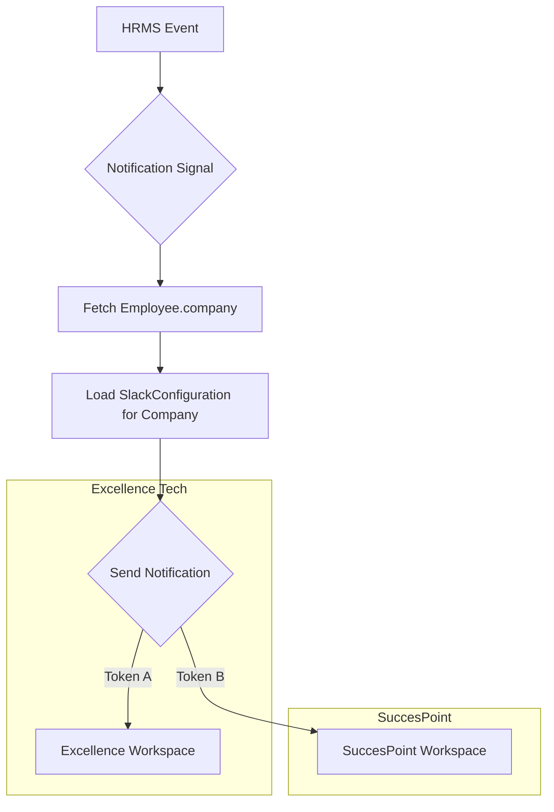

# Notifications Module (Multi-Tenant Slack Integration)

The Notifications module handles automated communication with employees across different companies via Slack. It uses a database-driven multi-tenant architecture to route messages correctly based on the employee's company.

## Visual Flow: Multi-Tenant Routing



## Setup Instructions

### 1. Slack App Configuration (Per Company)
For each company requiring Slack integration, perform the following in the [Slack App Dashboard](https://api.slack.com/apps):

1.  **Bot Token Scopes** (OAuth & Permissions):
    - `chat:write`: To send messages.
    - `users:read.email`: To lookup user IDs by email address.
    - `channels:read` & `groups:read`: To identify management channels.
2.  **Interactivity & Shortcuts**:
    - Turn **Interactivity** ON.
    - **Request URL**: `https://<your-domain>/slack/interactions/`
3.  **Event Subscriptions**:
    - Turn **Enable Events** ON.
    - **Request URL**: `https://<your-domain>/slack/interactions/`
    - **Subscribe to Bot Events**: `message.im`
4.  **Install App**: Install the app to the company workspace and copy the `Bot User OAuth Token`.

### 2. HRMS Admin Configuration
After creating the Slack App, register the details in the HRMS System:

1.  Connect to **Django Admin** (`/admin/`).
2.  Create a **Company** in the `Organizations` module.
3.  Create a **Slack Configuration** in the `Notifications` module:
    - **Company**: Select the relevant company.
    - **Bot Token**: Paste the `xoxb-...` token.
    - **Management Channel ID**: Port the Slack Channel ID where approvals should be sent (e.g., `C12345ABC`).
    - **Slack Team ID**: Enter the Team ID (fetchable via `fetch_team_ids.py` or from the Slack URL).

### 3. Employee Mapping
Employees must be linked to their respective **Company** in the Employee profile. The system maps Slack IDs using the **office email** stored in the database.

## Technical Details

### Multi-Tenant Service (`notifications/slack_utils.py`)
The `SlackNotificationService` is instantiated with a `company` object:
```python
service = SlackNotificationService(company=employee.company)
```
It dynamically loads the correct token and configuration for that specific tenant.

### Interactive Handlers (`notifications/views.py`)
The system identifies the tenant from the `team_id` sent by Slack in the interaction payload. This allows a single endpoint (`/slack/interactions/`) to handle multiple companies/workspaces simultaneously.

## Debugging
-   **Terminal Logs**: Look for `🔥 SLACK HIT` to verify connectivity.
-   **Debug Log**: Check `slack_debug.log` for raw payloads and errors.
-   **URL Fallbacks**: The system supports `/api/slack/interactions/` and `/slack/interactions/` with or without trailing slashes.